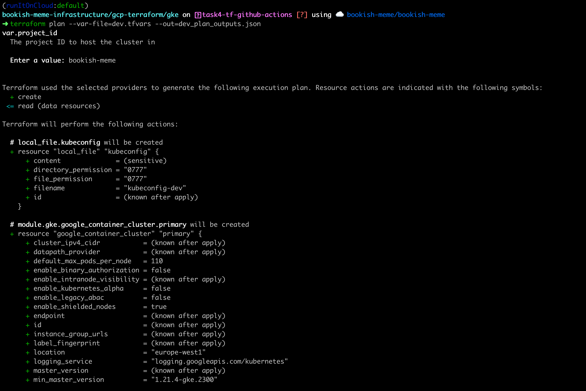
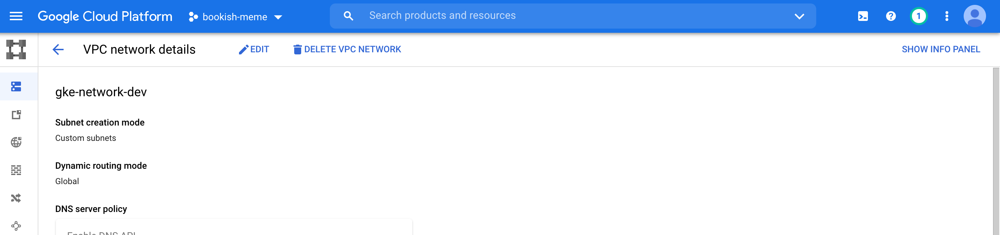
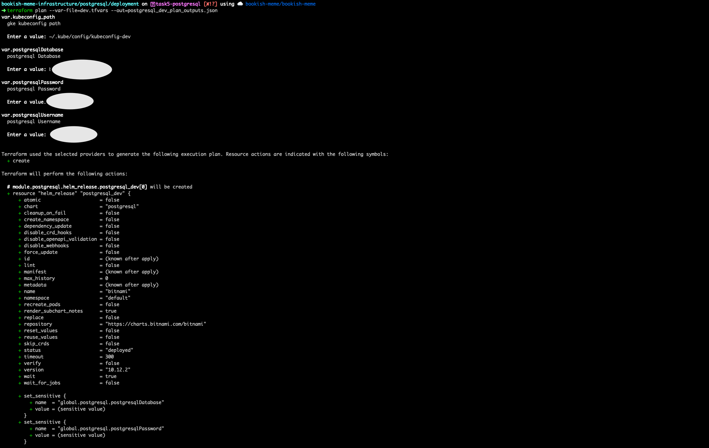
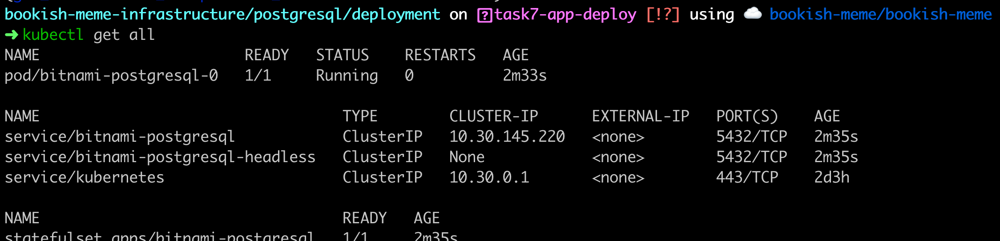
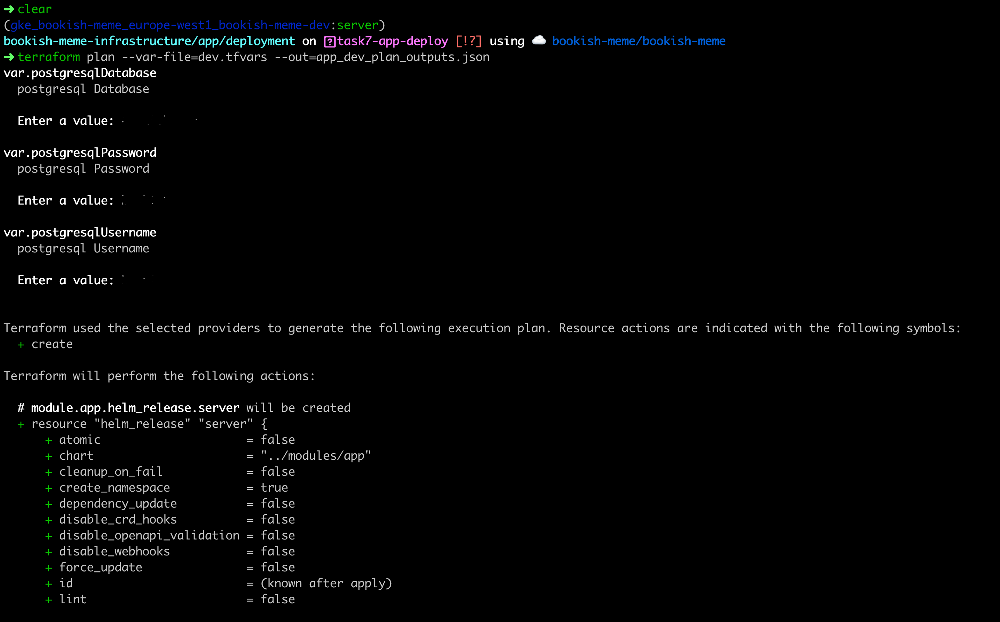
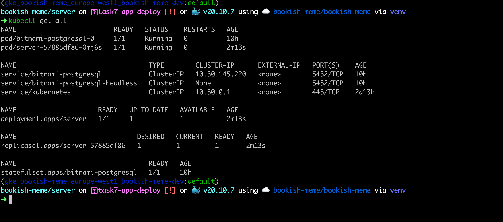
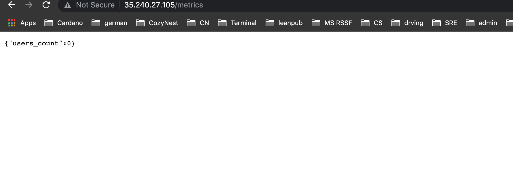
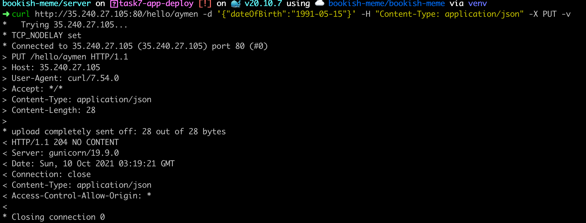
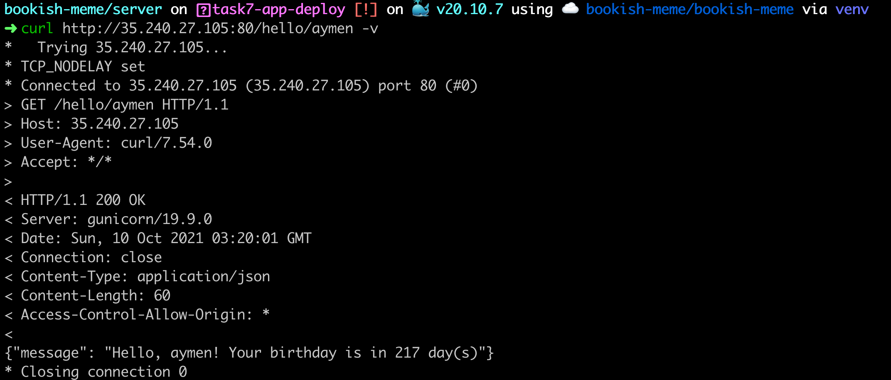

# bookish-meme-infrastructure
> When you're asked to Terraform Pluto


### High Level Diagram Architecture


### Tools and platforms

- `GCP`:  High-performance infrastructure for cloud computing, data analytics & machine learning. Secure, reliable and high performance cloud services. Try now with $300 free credit! Massive Scale. Deploy At Google Scale. Competitive Pricing. Focus On Your Product. Highly Scalable.

- `Terraform`: Terraform is an open-source infrastructure as code software tool that provides a consistent CLI workflow to manage hundreds of cloud services.

- `Kubernetes`: Kubernetes, also known as K8s, is an open-source system for automating deployment, scaling, and management of containerized applications.

- `Helm`: Helm helps you manage Kubernetes applications — Helm Charts help you define, install, and upgrade even the most complex Kubernetes application.

### Assumption And Prerequisites

- You have `kubectl` installed in your machine.
- You have `helm` installed in your machine.
- You have `terraform` installed in your machine.
- You have `gcloud` installed and configured.
- You have a GCP account, with a project.


### Provision GCP resources with Terraform

#### 1- Set up the GCP account

Before you start using the gcloud CLI and Terraform, you have to install the Google Cloud SDK bundle.

The bundle includes all that are necessary tools to authenticate your requests to your account on.

After you install the gcloud CLI, you need to link your account to the gcloud CLI as follwing:

```bash
gcloud --version
gcloud init
```
This will open a login page where you can authenticate with your credentials.

One more authentication step is necessary to complete the setup:

```bash
gcloud auth application-default login
```
Next, you will be prompted to use the default project or create a new one (if you are unsure, create a new project).

The required API's that need to be enabled are the compute and container ones.

You can enable them with:

```bash
gcloud components update
gcloud services enable compute.googleapis.com
gcloud services enable container.googleapis.com
```

#### 2- Provisioning a cluster using Terraform

**Create dev GKE cluster**

- Verify that the Terraform tool has been installed correctly with:

```bash
terraform version
```

- Set the working directory to gcp/gke

```bash
cd gcp/gke
```

- Initialize tge Terraform code

```bash
terraform init
``` 

- Verify the formatting, and the code validity 

```bash
terraform fmt
terraform validate
``` 

- Plan and apply Terraform code

```bash
terraform plan --var-file=dev.tfvars --out=dev_plan_outputs.json
```

```bash
terraform apply "dev_plan_outputs.json"
```

Repeat the same steps for the production cluster, replace `dev.tfvars` by `prod.tfvars`, `dev_plan_outputs.json` by `prod_plan_outputs.json` 

#### 3- Terraform Deployment log:

- Terraform Plan

[gcp terraform plan output](https://github.com/AymenSegni/bookish-meme-infrastructure/blob/main/assests/gcp-tf-plan.txt)



- Terraform Apply

[gcp terraform apply](https://github.com/AymenSegni/bookish-meme-infrastructure/blob/main/assests/gcp-tf-apply-dev.txt)


#### 4- Checking the GKE cluster on GCP




#### 5- Use kubectl to manage the GKE Cluster

- To get the dev kubeconfig credentials you can use the following gcloud command:

```bash
gcloud container clusters get-credentials bookish-meme-dev --region europe-west1 --project bookish-meme
```

- Export the kubeconfig file:

```bash
export KUBECONFIG=~/.kube/kubeconfig-dev # <--- path to your kubeconfig file, used by kubectl to connect to the cluster API
export KUBE_CONFIG_PATH=~/.kube/kubeconfig-dev # need for Terraform Kubernetes/Helm provider
``` 

- Check the cluster nodes

```bash
➜ kubectl get nodes
NAME                                           STATUS   ROLES    AGE    VERSION
gke-bookish-meme-dev-node-pool-23b666f0-zlc6   Ready    <none>   3d4h   v1.21.4-gke.2300
gke-bookish-meme-dev-node-pool-2c2a0d63-s956   Ready    <none>   3d4h   v1.21.4-gke.2300
gke-bookish-meme-dev-node-pool-65d00558-6xf5   Ready    <none>   3d4h   v1.21.4-gke.2300
```

> Same steps needed for the production cluster!

### Deploy PostgreSQL Cluster with Terraform and Helm


#### 1- Structure

In this setup we are going to use Terraform, Helm and the Terraform Helm Provider to deploy a PostgreSQL on the DEV GKE cluster and PostgreSQL HA cluster on the PROD GKE cluster.

The code is on the `postgresql/` folder in the following structure:

```bash
➜ tree  postgresql/
postgresql/
├── deployment
│   ├── dev.tfvars
│   ├── main.tf
│   ├── prod.tfvars
│   └── variables.tf
└── modules
    ├── main.tf
    └── variables.tf

2 directories, 6 files
```

#### 2- Deployment


- Set the working directory to postgresql/deployment

```bash
cd .. && cd postgresql/deployment
```

- Initialize tge Terraform code

```bash
terraform init
``` 

- Verify the formatting, and the code validity 

```bash
terraform fmt
terraform validate
``` 

- Plan and apply Terraform code

```bash
terraform plan --var-file=dev.tfvars --out=postgresql_dev_plan_outputs.json
```

Terraform will ask you to add the secret variables such as the PostgreSQL credentials. See the following screenshot and terminal log:

[PostgreSQL Terraform Plan Terminal](assests/postgresql-dev-plan.txt)



```bash
terraform apply "postgresql_dev_plan_outputs.json"
```
[PostgreSQL Terraform Apply Terminal log](assests/postgresql-dev-apply.txt)


> Repeat the same steps for the production cluster, replace `dev.tfvars` by `prod.tfvars`, `postgresql_dev_plan_outputs.json` by `postgresql_prod_plan_outputs.json` 


#### 4- Checking the PostgreSQL cluster resources on GKE

```bash
➜ kubectl get all | grep bitnami
pod/bitnami-postgresql-0     1/1     Running   0          25h
service/bitnami-postgresql            ClusterIP      10.30.145.220   <none>          5432/TCP       25h
service/bitnami-postgresql-headless   ClusterIP      None            <none>          5432/TCP       25h
statefulset.apps/bitnami-postgresql   1/1     25h
```




### Deploy Flask Server App on GKE with Terraform and Helm

#### 1- Application Code

Our awesome `Bookish Mem - When you're asked to Terraform Pluto` application code (with the container image) is hosted in this [github repository](https://github.com/AymenSegni/bookish-meme)


#### 2- App Deployment Structure

In this setup we are going to use Terraform, Kubernetes YAML, Helm and the Terraform Helm Provider to deploy the application on the  GKE cluster.

The code is on the `app/` folder in the following structure:

```bash
➜ tree
.
├── deployment
│   ├── dev.tfvars
│   ├── main.tf
│   ├── prod.tfvars
│   └── variables.tf
└── modules
    ├── app
    │   ├── Chart.yaml
    │   ├── dev-values.yaml
    │   ├── prod-values.yaml
    │   └── templates
    │       ├── deployment.yaml
    │       ├── secret.yaml
    │       └── service.yaml
    ├── main.tf
    └── variables.tf

4 directories, 12 files
```

#### 3- Deployment


- Set the working directory to postgresql/deployment

```bash
cd ../.. && cd app/deployment
```

- Initialize the Terraform code

```bash
terraform init
``` 

- Verify the formatting, and the code validity 

```bash
terraform fmt
terraform validate
``` 

- Plan and apply Terraform code

```bash
terraform plan --var-file=dev.tfvars --out=app_dev_plan_outputs.json
```
Terraform will ask you to add the secret variables such as the PostgreSQL credentials. See the following screenshot and terminal log:



[App deployment Terraform Plan Terminal](assests/app-tf-plan.txt)


```bash
terraform apply "app_dev_plan_outputs.json"
```

[App Terraform Apply Terminal log](assests/app-apply.txt)


> Repeat the same steps for the production cluster, replace `dev.tfvars` by `prod.tfvars`, `app_dev_plan_outputs.json` by `app_prod_plan_outputs.json` 


#### 4- Checking the App deployment on GKE

```bash
bookish-meme-infrastructure/app on  readme [✘!?] using ☁️  bookish-meme/bookish-meme via venv
➜ kubectl get all | grep server
pod/server-f65698478-m4x6n   1/1     Running   0          15h
service/server                        LoadBalancer   10.30.238.10    35.240.27.105   80:30000/TCP   15h
deployment.apps/server   1/1     1            1           15h
replicaset.apps/server-f65698478   1         1         1       15h
```



### Test the Application

To test the application functionality we need first to grab the cluster HTTP Load Balancer IP, as following:

```bash
➜ kubectl get svc/server
NAME     TYPE           CLUSTER-IP     EXTERNAL-IP     PORT(S)        AGE
server   LoadBalancer   10.30.238.10   35.240.27.105   80:30000/TCP   15h
(gke_bookish-meme_europe-west1_bookish-meme-dev:default)
```
The service IP is: `35.240.27.105`

Now we can run the queries:

1. Check the metrics:



2. PUT: Saves/updates the given user’s name and date of birth in the database.
Request: `PUT /hello/<username> { “dateOfBirth”: “YYYY-MM-DD” }`
Response: `204 No Content`.

Response Example:



3. GET: Returns hello birthday message for the given user
Request: `Get /hello/<username>`
Response: `200 OK`

Response Examples:




### 10-more steps to build a proper Cloud Native system

1. CI/CD: well CI/CD for everything, end-to-end CI/CD pipelines will be needed to deploy the infrasturce and the application

2. Use Terraform workspaces (dev and prod)

3. Use Terraform remote state to manage the state files

4. Use a proper Secret Management system to manage and inject secrets.

5. Monitoring and logging 

6. Service Mesh and API Management if you will add more services ;)

7. Admission Controller to enforce policies

8. Network Policies

9. RBAC

10. Testing and scanning


