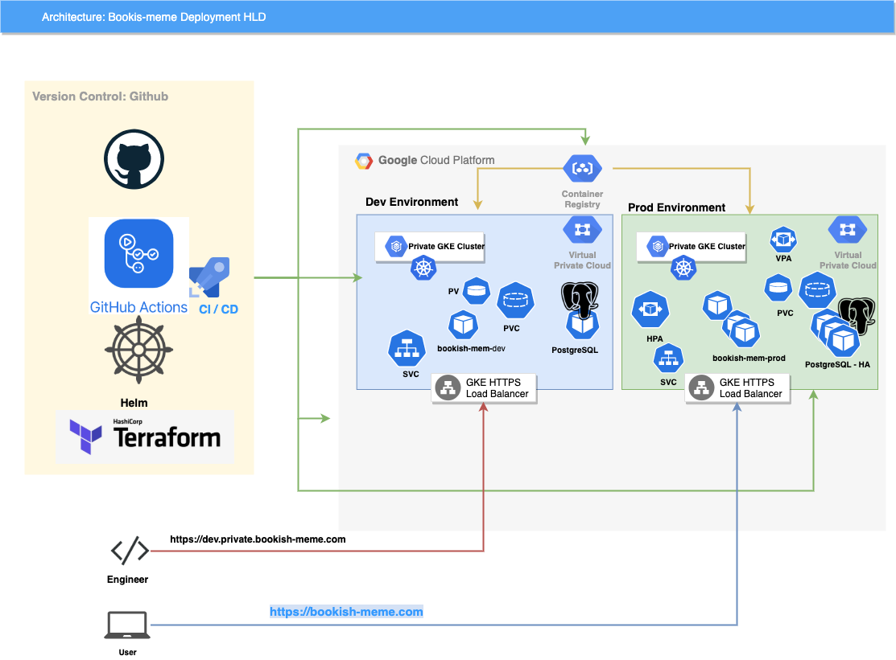
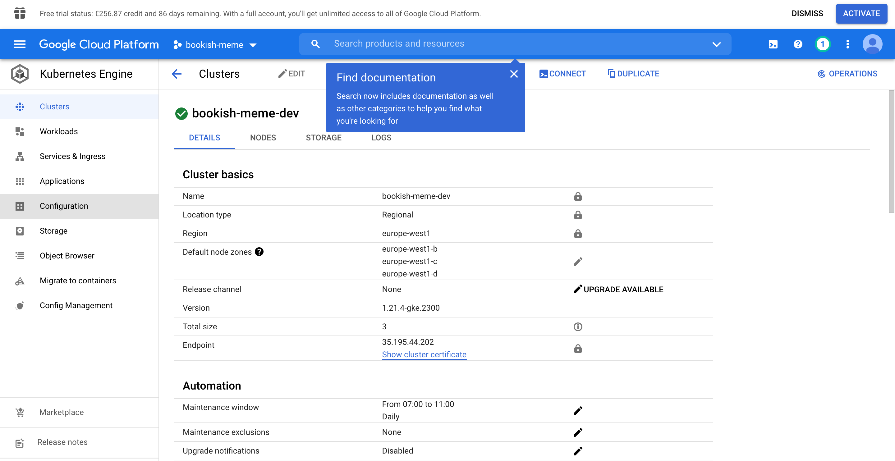

# bookish-meme-infrastructure
> When you're asked to Terraform Pluto


### High Level Diagram Architecture



### Tools and platforms

- `GCP`:  High-performance infrastructure for cloud computing, data analytics & machine learning. Secure, reliable and high performance cloud services. Try now with $300 free credit! Massive Scale. Deploy At Google Scale. Competitive Pricing. Focus On Your Product. Highly Scalable.

- `Terraform`: Terraform is an open-source infrastructure as code software tool that provides a consistent CLI workflow to manage hundreds of cloud services.

- `Kubernetes`: Kubernetes, also known as K8s, is an open-source system for automating deployment, scaling, and management of containerized applications.

- `Helm`: Helm helps you manage Kubernetes applications — Helm Charts help you define, install, and upgrade even the most complex Kubernetes application.

### Assumption And Prerequisites

- You have `kubectl` installed in your machine.
- You have `helm` installed in your machine.
- You have `terraform` installed in your machine.
- You have `gcloud` installed and configured.
- You have a GCP account, with a project.


### Provision GCP resources with Terraform

#### 1- Set up the GCP account

Before you start using the gcloud CLI and Terraform, you have to install the Google Cloud SDK bundle.

The bundle includes all that are necessary tools to authenticate your requests to your account on.

After you install the gcloud CLI, you need to link your account to the gcloud CLI as follwing:

```bash
gcloud --version
gcloud init
```
This will open a login page where you can authenticate with your credentials.

One more authentication step is necessary to complete the setup:

```bash
gcloud auth application-default login
```
Next, you will be prompted to use the default project or create a new one (if you are unsure, create a new project).

The required API's that need to be enabled are the compute and container ones.

You can enable them with:

```bash
gcloud components update
gcloud services enable compute.googleapis.com
gcloud services enable container.googleapis.com
```

#### 2- Provisioning a cluster using Terraform

**Create dev GKE cluster**

- Verify that the Terraform tool has been installed correctly with:

```bash
terraform version
```

- Set the working directory to gcp/gke

```bash
cd gcp/gke
```

- Initialize tge Terraform code

```bash
terraform init
``` 

- Verify the formatting, and the code validity 

```bash
terraform fmt
terraform validate
``` 

- Plan and apply Terraform code

```bash
terraform plan --var-file=dev.tfvars --out=dev_plan_outputs.json
```

```bash
terraform apply "dev_plan_outputs.json"
```

Repeat the same steps for the production cluster, replace `dev.tfvars` by `prod.tfvars`, `dev_plan_outputs.json` by `prod_plan_outputs.json` 

#### 3- Terraform Deployment log:

- [gcp terraform plan output](https://github.com/AymenSegni/bookish-meme-infrastructure/blob/main/assests/gcp-tf-plan.txt)

- [gcp terraform apply](https://github.com/AymenSegni/bookish-meme-infrastructure/blob/main/assests/gcp-tf-apply-dev.txt)

#### 4- Cluster creation



### Deploy PostgreSQL Cluster with Terraform and Helm


